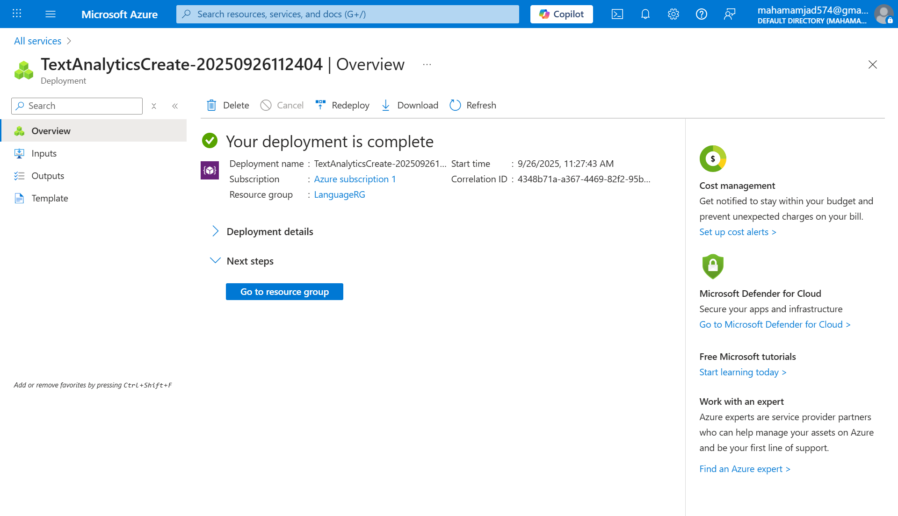
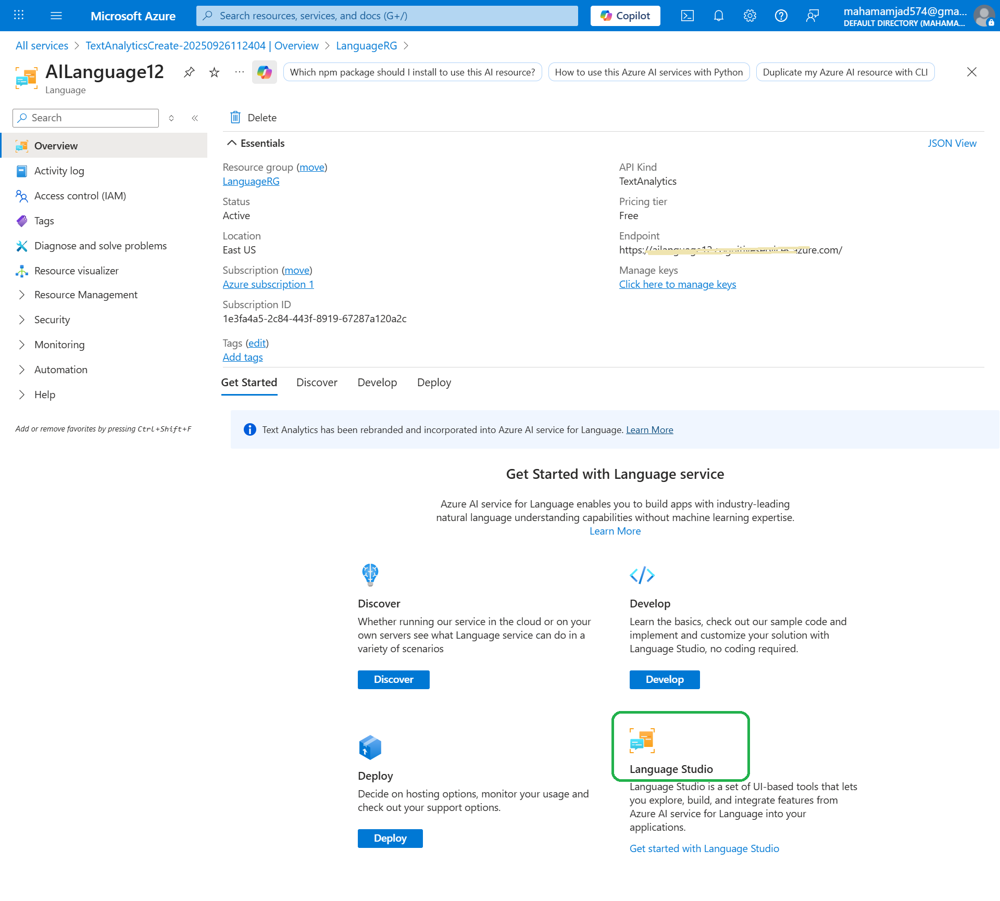
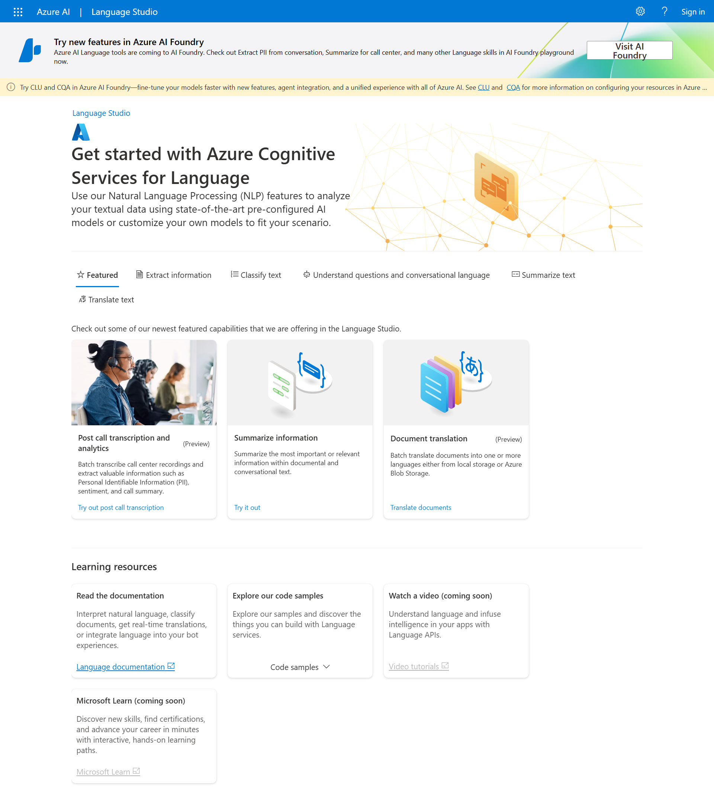
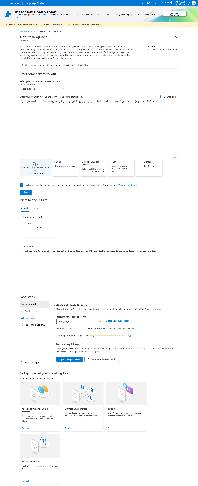
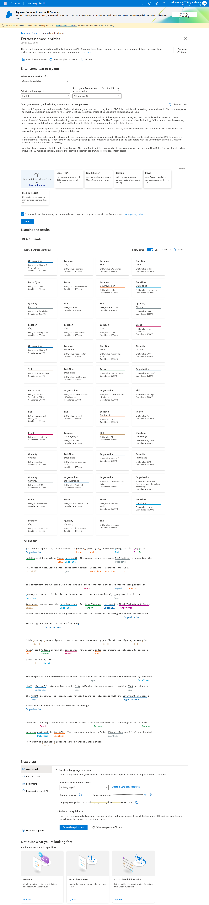
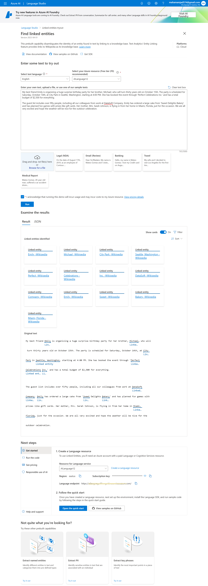
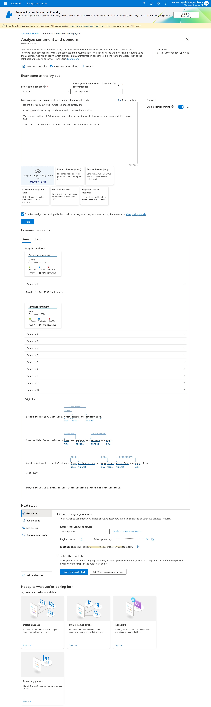
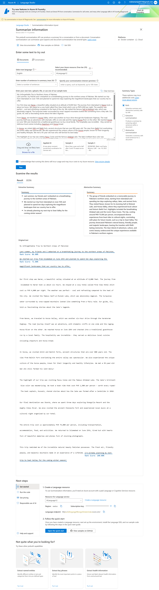

# Azure-NLP-Testing
Testing Azure AI Language Services - NLP Features

# Azure AI Language Services - NLP Features Testing

This project documents my hands-on testing of Azure AI Language services, exploring various natural language processing capabilities.

## 📋 Project Overview

I tested multiple NLP features in Azure Language Studio to understand how AI processes and analyzes text. This included language detection, entity recognition, sentiment analysis, and text summarization.

## 🛠️ Services & Features Tested

- **Azure AI Language Service** - Core NLP service deployment
- **Language Studio** - Web-based interface for testing NLP features
- **Detect Language** - Identifying text language automatically
- **Named Entity Recognition** - Extracting people, places, organizations from text
- **Linked Entities** - Connecting entities to knowledge bases
- **Sentiment Analysis** - Determining positive/negative/neutral sentiment
- **Text Summarization** - Generating concise summaries from longer text

## 📸 Testing Process & Results

### 1. Azure Service Deployment

*Azure AI Language service successfully deployed and ready for use*

### 2. AI Language Endpoint Configuration

*AI Language resource showing endpoint details and access points*

### 3. Language Studio Interface

*Main dashboard of Language Studio for accessing NLP features*

### 4. Language Detection Testing

*Testing the detect language feature with multilingual text samples*

### 5. Named Entity Recognition

*Entity recognition extracting organizations, people, and locations from text*

### 6. Linked Entities Analysis

*Entities linked to Wikipedia and knowledge bases for additional context*

### 7. Sentiment Analysis

*Sentiment analysis determining positive, negative, and neutral tones in text*

### 8. Text Summarization

*AI-generated summaries of longer text documents*

## 💡 Key Learnings

- **Easy Setup**: Azure AI services are straightforward to deploy and configure
- **Accurate Results**: NLP features provided reliable analysis across different text types
- **User-Friendly Interface**: Language Studio makes complex AI accessible without coding
- **Practical Applications**: These services can power chatbots, content analysis, and data processing tools

## 🔮 Future Exploration

- Custom model training for domain-specific text analysis
- Integration with web applications using Azure SDKs
- Testing additional features like key phrase extraction and PII detection

---

*Documentation of Azure AI Language services testing - Practical NLP implementation experience*
